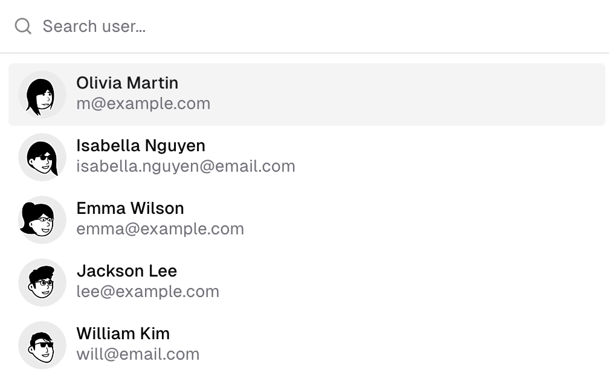
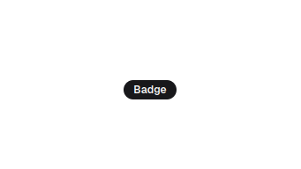

# Desafio Técnico de Frontend

## Objetivo Geral

Desenvolver uma interface de usuário (UI) dinâmica e interativa utilizando React, que interaja com a API pública da [PokéAPI](https://pokeapi.co) para listar pokémons. Este teste é projetado para avaliar habilidades em frontend, incluindo o consumo de APIs, gerenciamento de estados, e uso eficiente de componentes.

## Descrição do Projeto

### Liste pokémons:

A aplicação deverá consumir os dados da [PokéAPI v2](https://pokeapi.co/api/v2/pokemon) e exibir uma lista de pokémons. Cada item da lista deve incluir a `imagem do pokemon`, seu `nome` e suas `habilidades` principais.
- <b>*Imagens como Avatares:*</b> A imagem do pokémon deve estar formato de avatar.
- <b>*Fallback de Imagem:*</b> Durante o carregamento ou em caso de erro:
  - Exiba as iniciais do nome do pokémon em caixa alta. Por exemplo, `"Pikachu"` deve mostrar `"P"`.
  - Nomes compostos por mais de uma palavra devem exibir as iniciais da primeira e da segunda palavra. Por exemplo: `"Pokemon Amarelo"` deve mostrar `"PA"`.
  - Utilize `cores variadas` para o background do avatar fallback. Por exemplo, verde, amarelo, azul, vermelho, etc
- <b>*Habilidades como Badges:*</b> Apresente as habilidades do pokémon em formato de `badges` abaixo do nome.

- *API Utilizada:* [PokéAPI v2](https://pokeapi.co/api/v2/pokemon)

### Interatividade:
Como nós valorizamos muito a experiência dos nossos usuários esperamos que você implemente funcionalidades interativas como pesquisa e navegação por teclado.
- <b>*Foco e Navegação por Teclado:*</b> Ao passar o ponteiro do mouse sobre um item da lista, este item deve receber foco, habilitando a navegação via teclado com as teclas `ArrowUp` e `ArrowDown` para navegar entre os itens da lista.
- <b>*Atalhos de Teclado para Pesquisa:*</b> As teclas de atalho `"CTRL + /"` ou `"CMD + /"` devem ser usadas para colocar o campo de pesquisa em foco. Quando o campo de pesquisa estiver em foco, a navegação via teclado deve ser habilitada e permitir a seleção de pokémons diretamente na lista de resultados filtrados.

### Design Responsivo:
- Garanta uma boa usabilidade em dispositivos móveis e desktops.

## Expectativas Técnicas

- <b>*Uso de Componentes e Hooks:*</b> Construa componentes funcionais e utilize hooks efetivamente.
- <b>*Gerenciamento Avançado de Estado:*</b> Demonstre suas habilidades ao lidar com gerenciamento de estado especialmente, mas não se limitando a HTTP State e cache de requisições.
- <b>*Estilização:*</b> Priorize a consistência visual e acessibilidade.
- <b>*Código Limpo e Documentação:*</b> Código legível e bem documentado. Documente suas escolhas de design e arquitetura no README.
- <b>*Tratamento Adequado de Erros:*</b> Implemente tratamento de erros para manter a estabilidade da aplicação.

## Critérios de Avaliação

- <b>*Funcionalidade:*</b> Conformidade com os requisitos funcionais.
- <b>*Qualidade do Código:*</b> Clareza, boas práticas de programação, e adesão aos padrões de projeto.
- <b>*UI/UX:*</b> Estética, usabilidade e acessibilidade.
- <b>*Inovação e Criatividade:*</b> Soluções inovadoras e uso criativo das tecnologias.
- <b>*Extra Mile: Testes*</b> - Implementação de testes automatizados de qualidade e abrangentes para validar as funcionalidades e a estabilidade da aplicação será considerada um diferencial

## Recomendações e Sugestões
Embora encorajemos você a utilizar as ferramentas e bibliotecas com as quais se sinta mais confortável, aqui estão algumas sugestões que acreditamos que possam facilitar o desenvolvimento do seu projeto.
- <b>*Shadcn-ui:*</b> [Shadcn-ui](https://ui.shadcn.com) para criação de componentes com design limpo e moderno com consistência visual e recursos de acessibilidade.
- <b>*React Query e Axios:*</b> Para gerenciamento de chamadas de API e o estado dos dados de forma eficiente. Essa combinação pode ajudar a simplificar a lógica de fetching e caching.
- <b>*TailwindCSS:*</b> Para estilização.
- <b>*TypeScript:*</b> Para tipagem estática.
- <b>*Conventional Commits:*</b> Para manutenção do repositório.

 Lembramos que estas são apenas sugestões e que a escolha das ferramentas fica a seu critério.

## Recursos Adicionais

- *Documentação da API:* Mais informações sobre a API disponíveis na [PokéAPI](https://pokeapi.co).

Boa sorte! Esperamos que este desafio ofereça uma oportunidade valiosa para demonstrar suas habilidades técnicas e criativas.