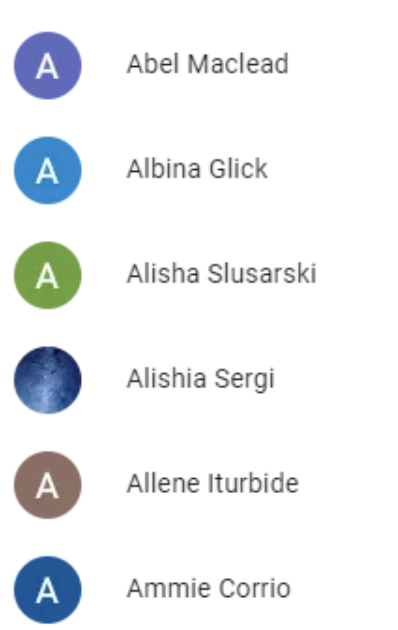

# react-challenge

## Objetivo

- Criação de uma interface que liste os pokemons da seguinte API: https://pokeapi.co/
- A listagem precisa ter (API de listagem: https://pokeapi.co/api/v2/pokemon):
  - Foto de perfil, com um fallback com as iniciais do pokemon
    - Se o nome for "bulbasaur", o fallback será a letra "B". Se for um nome composto, precisará pegar a inicial do primeiro e do segundo nome. Deverá ignorar demais nomes (Gabriel -> G, Gabriel Henrique -> GH, Gabriel Henrique Junior -> GH)
    - A foto do avatar precisará ser redonda. Se o fallback estiver em uso, precisa ter um background que vai alternar em cores (verde, vermelho, azul, amarelo,...)
      
  - Nome do pokemon
  - Habilidades do pokemon em formato de 'etiquetas' abaixo do nome (na posição do email)
    - https://pokeapi.co/api/v2/pokemon/1/
- A lista deverá ter um campo de busca, filtrando pelo nome.
  - A tecla de atalho "CTRL + /" ou "CMD + /" precisam gerar foco no campo de busca
- Ao passar o mouse por cima, o pokemon terá um "foco" atribuído a ele. A partir de então, o uso do teclado (ArrowUp and ArrowDown keys) farão selecionar o próximo pokemon.
  - Com o foco no input de busca, a tecla para baixo (ArrowDown) trará o foco para o primeiro pokemon

## Orientações e Sugestões

- Recomendamos a utilização da Lib https://ui.shadcn.com/ para a criação de componentes
- Recomendamos o uso da Lib React Query juntamente com Axios para as consultas
- Recomendamos a utilização de TailwindCSS (https://tailwindcss.com/)
- Recomendamos o uso de typescript, tipando todas as variáveis e funções
- Recomendamos o uso de tratamento de erro
- Recomendamos o uso de testes
- Recomendamos o uso de conventional commits (https://www.conventionalcommits.org/en/v1.0.0/)

## Dúvidas?

- Qualquer dúvida estamos a disposição, não exite em nos procurar.
